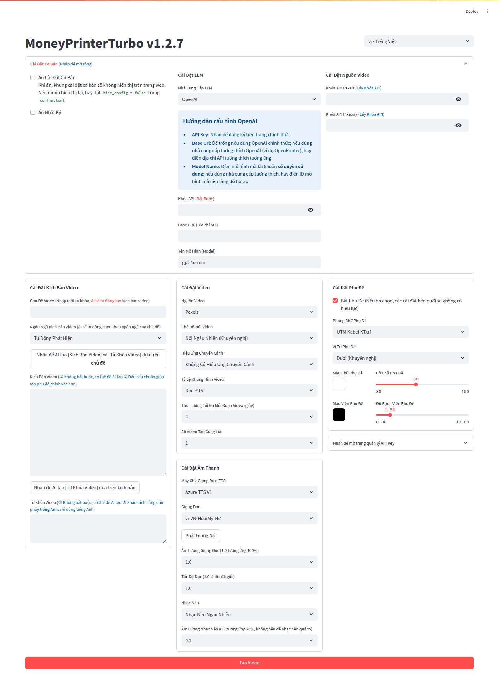

<div align="center">
<h1 align="center">MoneyPrinterTurbo 💸</h1>

<p align="center">
  <a href="https://github.com/harry0703/MoneyPrinterTurbo/stargazers"></a>
  <a href="https://github.com/harry0703/MoneyPrinterTurbo/issues"></a>
  <a href="https://github.com/harry0703/MoneyPrinterTurbo/network/members"></a>
  <a href="https://github.com/harry0703/MoneyPrinterTurbo/blob/main/LICENSE"></a>
</p>

<h3><a href="README.md">简体中文</a> | <a href="README-en.md">English</a> | Tiếng Việt</h3>

<div align="center">
  <a href="https://trendshift.io/repositories/8731" target="_blank"></a>
</div>

Chỉ cần cung cấp một <b>chủ đề</b> hoặc <b>từ khóa</b> cho video, hệ thống sẽ tự động tạo kịch bản video, tư liệu hình ảnh,
phụ đề và nhạc nền, rồi ghép lại thành một video ngắn chất lượng cao.

### Giao diện Web (WebUI)



> Giao diện Web hỗ trợ tiếng Việt: chọn **vi - Tiếng Việt** trong bộ chọn ngôn ngữ ở góc trên bên phải, hoặc đặt
> `language = "vi"` trong mục `[ui]` của tệp `config.toml`.
> Ở giao diện tiếng Việt, kịch bản, giọng đọc và phụ đề mặc định đều là tiếng Việt. Phông phụ đề mặc định là
> `LiberationSerif-Bold.ttf` (kiểu chữ giống Times New Roman, dựa trên Tinos, giấy phép SIL OFL), hiển thị đủ dấu tiếng Việt.

### Giao diện API


</div>

## Tính năng 🎯

- [x] **Kiến trúc MVC** hoàn chỉnh, mã nguồn **có cấu trúc rõ ràng**, dễ bảo trì, hỗ trợ cả `API`
  và `giao diện Web`
- [x] Hỗ trợ kịch bản video do **AI tạo ra**, cũng như **kịch bản tùy chỉnh**
- [x] Hỗ trợ nhiều kích thước **video độ phân giải cao**
    - [x] Dọc 9:16, `1080x1920`
    - [x] Ngang 16:9, `1920x1080`
- [x] Hỗ trợ **tạo video hàng loạt**, cho phép tạo nhiều video cùng lúc rồi chọn ra video
  ưng ý nhất
- [x] Hỗ trợ thiết lập **thời lượng của từng đoạn video**, giúp dễ dàng điều chỉnh tần suất chuyển cảnh
- [x] Hỗ trợ kịch bản video bằng cả **tiếng Trung** và **tiếng Anh**
- [x] Hỗ trợ tổng hợp **nhiều giọng đọc**, có thể **nghe thử trực tiếp** hiệu quả
- [x] Hỗ trợ **tạo phụ đề**, có thể điều chỉnh `phông chữ`, `vị trí`, `màu sắc`, `kích thước`, đồng thời
  hỗ trợ `viền phụ đề`
- [x] Hỗ trợ **nhạc nền**, ngẫu nhiên hoặc chỉ định tệp nhạc, có thể điều chỉnh `âm lượng nhạc nền`
- [x] Nguồn tư liệu video có **độ phân giải cao** và **miễn phí bản quyền**, bạn cũng có thể dùng **tư liệu cục bộ** của riêng mình
- [x] Hỗ trợ tích hợp nhiều mô hình như **OpenAI**, **Moonshot**, **Azure**, **gpt4free**, **one-api**, **Qwen**, **Google Gemini**, **Ollama**, **DeepSeek**, **MiniMax**, **ERNIE**, **Pollinations**, **ModelScope** và nhiều mô hình khác

## Tạo video hàng loạt 📋

Trên giao diện Web, mở mục **Tạo Hàng Loạt** (phía trên nút **Tạo Video**):

1. Chỉnh các cài đặt video, giọng đọc, phụ đề… như khi tạo một video. Mọi video trong lô sẽ dùng chung các cài đặt này.
2. Nhập mỗi dòng một chủ đề, **hoặc** tải lên file CSV (nhấn **Tải file CSV mẫu** để lấy mẫu):

   | chu_de (bắt buộc) | kich_ban (tùy chọn) | tu_khoa (tùy chọn) |
   |---|---|---|
   | 5 mẹo tiết kiệm tiền mỗi tháng | | |
   | Cà phê sữa đá Việt Nam | Cà phê sữa đá là thức uống quen thuộc… | vietnamese coffee, iced coffee |

   Bỏ trống `kich_ban` / `tu_khoa` thì AI sẽ tự viết. Tên cột tiếng Anh (`subject`, `script`, `keywords`) cũng được chấp nhận.
3. Nhấn **Bắt Đầu Tạo Hàng Loạt**. Chủ đề nào lỗi sẽ được bỏ qua, các chủ đề còn lại vẫn tiếp tục.
4. Kết quả: mỗi video kèm **tiêu đề và hashtag** do AI gợi ý để đăng TikTok / Reels / Shorts, và file
   `storage/tasks/batch-.../ket_qua.csv` (mở bằng Excel) liệt kê đường dẫn video, tiêu đề, hashtag, trạng thái.
   File CSV được ghi lại sau mỗi video, nên nếu bị dừng giữa chừng vẫn giữ được các video đã xong.

> Lưu ý: các nền tảng (YouTube, TikTok) không trả tiền cho nội dung sản xuất hàng loạt theo khuôn mẫu, ít giá trị.
> Hãy kiểm tra lại nội dung, thêm góc nhìn riêng, và gắn nhãn nội dung do AI tạo theo quy định của từng nền tảng.

## Video minh họa 📺

### Dọc 9:16

<table>
<thead>
<tr>
<th align="center"><g-emoji class="g-emoji" alias="arrow_forward">▶️</g-emoji> Làm thế nào để cuộc sống thêm thú vị </th>
<th align="center"><g-emoji class="g-emoji" alias="arrow_forward">▶️</g-emoji> Ý nghĩa của cuộc sống là gì</th>
</tr>
</thead>
<tbody>
<tr>
<td align="center"><video src="https://github.com/harry0703/MoneyPrinterTurbo/assets/4928832/a84d33d5-27a2-4aba-8fd0-9fb2bd91c6a6"></video></td>
<td align="center"><video src="https://github.com/harry0703/MoneyPrinterTurbo/assets/4928832/112c9564-d52b-4472-99ad-970b75f66476"></video></td>
</tr>
</tbody>
</table>

### Ngang 16:9

<table>
<thead>
<tr>
<th align="center"><g-emoji class="g-emoji" alias="arrow_forward">▶️</g-emoji> Ý nghĩa của cuộc sống là gì</th>
<th align="center"><g-emoji class="g-emoji" alias="arrow_forward">▶️</g-emoji> Tại sao nên tập thể dục</th>
</tr>
</thead>
<tbody>
<tr>
<td align="center"><video src="https://github.com/harry0703/MoneyPrinterTurbo/assets/4928832/346ebb15-c55f-47a9-a653-114f08bb8073"></video></td>
<td align="center"><video src="https://github.com/harry0703/MoneyPrinterTurbo/assets/4928832/271f2fae-8283-44a0-8aa0-0ed8f9a6fa87"></video></td>
</tr>
</tbody>
</table>

## Yêu cầu hệ thống 📦

- Nền tảng khuyến nghị: Windows 10 trở lên, macOS 11 trở lên, hoặc một bản phân phối Linux phổ biến
- Không bắt buộc phải có GPU, nhưng nên có nếu bạn muốn chuyển giọng nói thành văn bản cục bộ nhanh hơn, xử lý video nhanh hơn hoặc tạo video hàng loạt mượt mà hơn

| Hạng mục | Tối thiểu | Khuyến nghị | Tối ưu |
| --- | --- | --- | --- |
| CPU | 4 nhân | 6 đến 8 nhân | Từ 8 nhân trở lên |
| RAM | 4 GB | 8 GB | Từ 16 GB trở lên |
| GPU | Không bắt buộc | VRAM từ 4 GB trở lên | VRAM từ 8 GB trở lên |

- Nếu bạn chủ yếu dùng LLM trên đám mây, TTS trên đám mây và nguồn tư liệu trực tuyến, thì CPU và RAM quan trọng hơn GPU
- Nếu bạn dùng `faster-whisper`, tạo video hàng loạt hoặc xử lý cục bộ nặng hơn, GPU sẽ cải thiện đáng kể tốc độ xử lý

## Bắt đầu nhanh 🚀

### Cách cài đặt khuyến nghị

- Người dùng Windows: ưu tiên dùng gói cài đặt một chạm để trải nghiệm cục bộ nhanh nhất
- Người dùng MacOS / Linux: dùng `uv sync --frozen` làm cách cài đặt cục bộ chính
- Nếu bạn muốn môi trường chạy tách biệt hơn: hãy triển khai bằng Docker

### Chạy trên Google Colab 
Muốn dùng thử MoneyPrinterTurbo mà không cần thiết lập môi trường cục bộ? Hãy chạy trực tiếp trên Google Colab!

[](https://colab.research.google.com/github/harry0703/MoneyPrinterTurbo/blob/main/docs/MoneyPrinterTurbo.ipynb)


### Windows

Gói tải về hiện vẫn là bản đóng gói cũ `v1.2.6`. Sau khi tải về, hãy chạy `update.bat` trước để cập nhật lên mã nguồn mới nhất.

Google Drive (v1.2.6): https://drive.google.com/file/d/1HsbzfT7XunkrCrHw5ncUjFX8XX4zAuUh/view?usp=sharing

Sau khi tải về, nên **nhấp đúp** vào `update.bat` trước để cập nhật lên **mã nguồn mới nhất**, sau đó nhấp đúp vào `start.bat` để khởi chạy

Sau khi khởi chạy, trình duyệt sẽ tự động mở (nếu trang hiển thị trống, nên dùng **Chrome** hoặc **Edge**)

### Các hệ điều hành khác

Hiện chưa có gói khởi chạy một chạm. Xem phần **Cài đặt & Triển khai** bên dưới. Nên dùng **docker** để triển khai vì thuận tiện hơn.

## Cài đặt & Triển khai 📥

### Chuẩn bị

#### ① Sao chép (clone) dự án

```shell
git clone https://github.com/harry0703/MoneyPrinterTurbo.git
```

#### ② Chỉnh sửa tệp cấu hình

- Sao chép tệp `config.example.toml` và đổi tên thành `config.toml`
- Làm theo hướng dẫn trong tệp `config.toml` để cấu hình `pexels_api_keys` và `llm_provider`, rồi tùy theo
  nhà cung cấp dịch vụ của llm_provider mà thiết lập API Key tương ứng

### Triển khai bằng Docker 🐳

#### ① Khởi chạy container Docker

Nếu bạn chưa cài Docker, vui lòng cài đặt trước tại https://www.docker.com/products/docker-desktop/
Nếu bạn dùng hệ điều hành Windows, vui lòng tham khảo tài liệu của Microsoft:

1. https://learn.microsoft.com/en-us/windows/wsl/install
2. https://learn.microsoft.com/en-us/windows/wsl/tutorials/wsl-containers

```shell
cd MoneyPrinterTurbo
docker-compose up
```

> Lưu ý: Phiên bản docker mới nhất sẽ tự động cài docker compose dưới dạng plugin, khi đó lệnh khởi chạy đổi thành `docker compose up `

#### ② Truy cập giao diện Web

Mở trình duyệt và truy cập http://0.0.0.0:8501

#### ③ Truy cập giao diện API

Mở trình duyệt và truy cập http://0.0.0.0:8080/docs hoặc http://0.0.0.0:8080/redoc

### Triển khai thủ công 📦

#### ① Tạo môi trường ảo Python

Nên dùng [uv](https://docs.astral.sh/uv/) để quản lý môi trường Python và các thư viện phụ thuộc, với Python `3.11` là phiên bản mặc định.

```shell
git clone https://github.com/harry0703/MoneyPrinterTurbo.git
cd MoneyPrinterTurbo
uv python install 3.11
uv sync --frozen
```

Nếu bạn chưa dùng `uv`, bạn vẫn có thể dùng `venv + pip`.

```shell
python3.11 -m venv .venv
source .venv/bin/activate
pip install -r requirements.txt
```

Lưu ý:
- `pyproject.toml` hiện là tệp khai báo phụ thuộc chính.
- `uv.lock` cố định môi trường đã được phân giải, vì vậy mặc định nên dùng `uv sync --frozen`.
- `requirements.txt` chỉ được giữ lại cho cách cài đặt cũ dựa trên `pip`.

#### ② Cài đặt ImageMagick

###### Windows:

- Tải về tại https://imagemagick.org/script/download.php, chọn phiên bản Windows, nhớ chọn phiên bản **thư viện tĩnh (static)**, ví dụ ImageMagick-7.1.1-32-Q16-x64-**static**.exe
- Cài đặt ImageMagick vừa tải về, **không thay đổi đường dẫn cài đặt**
- Chỉnh sửa tệp cấu hình `config.toml`, đặt `imagemagick_path` thành đường dẫn cài đặt thực tế của bạn

###### MacOS:

```shell
brew install imagemagick
````

###### Ubuntu

```shell
sudo apt-get install imagemagick
```

###### CentOS

```shell
sudo yum install ImageMagick
```

#### ③ Khởi chạy giao diện Web 🌐

Lưu ý: bạn cần chạy các lệnh sau trong `thư mục gốc` của dự án MoneyPrinterTurbo

###### Windows

```shell
uv run streamlit run ./webui/Main.py --browser.gatherUsageStats=False
```

Nếu bạn đã tự kích hoạt môi trường ảo, bạn vẫn có thể chạy:

```bat
webui.bat
```

###### MacOS hoặc Linux

```shell
uv run streamlit run ./webui/Main.py --browser.gatherUsageStats=False
```

Nếu bạn đã tự kích hoạt môi trường ảo, bạn vẫn có thể chạy:

```shell
sh webui.sh
```

Sau khi khởi chạy, trình duyệt sẽ tự động mở

#### ④ Khởi chạy dịch vụ API 🚀

```shell
uv run python main.py
```

Nếu bạn đã tự kích hoạt môi trường ảo, bạn vẫn có thể chạy:

```shell
python main.py
```

## Lời cảm ơn đặc biệt 🙏

Việc **triển khai** và **sử dụng** dự án này có thể gây đôi chút khó khăn cho người mới bắt đầu. Chúng tôi xin
gửi lời cảm ơn đặc biệt tới

**RecCloud (Nền tảng dịch vụ đa phương tiện ứng dụng AI)** vì đã cung cấp dịch vụ `Tạo video bằng AI` miễn phí dựa trên
dự án này. Dịch vụ cho phép sử dụng trực tuyến mà không cần triển khai, rất tiện lợi.

- Phiên bản tiếng Trung: https://reccloud.cn
- Phiên bản tiếng Anh: https://reccloud.com


## Cảm ơn nhà tài trợ 🙏

Cảm ơn Picwish https://picwish.com đã ủng hộ và tài trợ cho dự án này, giúp dự án được cập nhật và duy trì liên tục.

Picwish tập trung vào **lĩnh vực xử lý hình ảnh**, cung cấp bộ **công cụ xử lý ảnh** phong phú giúp đơn giản hóa tối đa các thao tác phức tạp, thực sự khiến việc xử lý ảnh trở nên dễ dàng hơn.


Sau khi khởi chạy, bạn có thể xem `tài liệu API` tại http://127.0.0.1:8080/docs và thử nghiệm trực tiếp các API
ngay trên trang để trải nghiệm nhanh.

## Tổng hợp giọng nói 🗣

Danh sách tất cả các giọng đọc được hỗ trợ có thể xem tại đây: [Danh sách giọng đọc](./docs/voice-list.txt)

2024-04-16 v1.1.2 Bổ sung 9 giọng đọc tổng hợp mới của Azure, cần cấu hình API KEY. Các giọng đọc này nghe chân thực hơn.

## Tạo phụ đề 📜

Hiện có 2 cách để tạo phụ đề:

- **edge**: Tốc độ tạo nhanh hơn, hiệu năng tốt hơn, không đòi hỏi cấu hình máy tính cụ thể, nhưng
  chất lượng có thể không ổn định
- **whisper**: Tốc độ tạo chậm hơn, hiệu năng kém hơn, đòi hỏi cấu hình máy tính nhất định, nhưng
  chất lượng đáng tin cậy hơn

Bạn có thể chuyển đổi giữa hai cách bằng cách sửa `subtitle_provider` trong tệp cấu hình `config.toml`

Nên dùng chế độ `edge`, và chuyển sang chế độ `whisper` nếu chất lượng phụ đề tạo ra chưa
đạt yêu cầu.

> Lưu ý:
>
> 1. Ở chế độ whisper, bạn cần tải một tệp mô hình từ HuggingFace, dung lượng khoảng 3GB, vui lòng đảm bảo kết nối mạng ổn định
> 2. Nếu để trống, phụ đề sẽ không được tạo.

> Do HuggingFace không truy cập được từ Trung Quốc, bạn có thể dùng các cách sau để tải tệp mô hình `whisper-large-v3`

Liên kết tải về:

- Baidu Netdisk: https://pan.baidu.com/s/11h3Q6tsDtjQKTjUu3sc5cA?pwd=xjs9
- Quark Netdisk: https://pan.quark.cn/s/3ee3d991d64b

Sau khi tải mô hình về, hãy giải nén và đặt toàn bộ thư mục vào `.\MoneyPrinterTurbo\models`,
Đường dẫn tệp cuối cùng sẽ có dạng: `.\MoneyPrinterTurbo\models\whisper-large-v3`

```
MoneyPrinterTurbo
  ├─models
  │   └─whisper-large-v3
  │          config.json
  │          model.bin
  │          preprocessor_config.json
  │          tokenizer.json
  │          vocabulary.json
```

## Nhạc nền 🎵

Nhạc nền cho video nằm trong thư mục `resource/songs` của dự án.
> Dự án hiện kèm theo một số bản nhạc mặc định lấy từ video YouTube. Nếu có vấn đề về bản quyền, vui lòng
> xóa chúng.

## Phông chữ phụ đề 🅰

Phông chữ dùng để hiển thị phụ đề video nằm trong thư mục `resource/fonts` của dự án, bạn cũng có thể thêm
phông chữ của riêng mình.

## Câu hỏi thường gặp 🤔

### ❓RuntimeError: No ffmpeg exe could be found

Thông thường, ffmpeg sẽ được tự động tải về và nhận diện.
Tuy nhiên, nếu môi trường của bạn gặp sự cố khiến việc tải tự động không thực hiện được, bạn có thể gặp lỗi sau:

```
RuntimeError: No ffmpeg exe could be found.
Install ffmpeg on your system, or set the IMAGEIO_FFMPEG_EXE environment variable.
```

Khi đó, bạn có thể tải ffmpeg tại https://www.gyan.dev/ffmpeg/builds/, giải nén và đặt `ffmpeg_path` thành
đường dẫn cài đặt thực tế của bạn.

```toml
[app]
# Please set according to your actual path, note that Windows path separators are \\
ffmpeg_path = "C:\\Users\\harry\\Downloads\\ffmpeg.exe"
```

### ❓ImageMagick is not installed on your computer (ImageMagick chưa được cài đặt trên máy tính)

[issue 33](https://github.com/harry0703/MoneyPrinterTurbo/issues/33)

1. Làm theo `địa chỉ tải về` được cung cấp trong `cấu hình mẫu` để
   cài đặt https://imagemagick.org/archive/binaries/ImageMagick-7.1.1-30-Q16-x64-static.exe, dùng bản thư viện tĩnh
2. Không cài đặt vào đường dẫn có chứa ký tự tiếng Trung (hoặc ký tự không phải ASCII) để tránh các sự cố khó lường

[issue 54](https://github.com/harry0703/MoneyPrinterTurbo/issues/54#issuecomment-2017842022)

Với hệ điều hành Linux, bạn có thể cài đặt thủ công, tham khảo https://cn.linux-console.net/?p=16978

Cảm ơn [@wangwenqiao666](https://github.com/wangwenqiao666) đã nghiên cứu và tìm hiểu vấn đề này

### ❓Chính sách bảo mật của ImageMagick chặn các thao tác liên quan đến tệp tạm @/tmp/tmpur5hyyto.txt

Bạn có thể tìm thấy các chính sách này trong tệp cấu hình policy.xml của ImageMagick.
Tệp này thường nằm ở /etc/ImageMagick-`X`/ hoặc vị trí tương tự trong thư mục cài đặt ImageMagick.
Sửa mục có chứa `pattern="@"`, đổi `rights="none"` thành `rights="read|write"` để cho phép đọc và ghi tệp.

### ❓OSError: [Errno 24] Too many open files

Sự cố này do hệ thống giới hạn số lượng tệp được mở cùng lúc. Bạn có thể khắc phục bằng cách tăng giới hạn số tệp mở của hệ thống.

Kiểm tra giới hạn hiện tại:

```shell
ulimit -n
```

Nếu giá trị quá thấp, bạn có thể tăng lên, ví dụ:

```shell
ulimit -n 10240
```

### ❓Tải mô hình Whisper thất bại, với lỗi như sau

LocalEntryNotfoundEror: Cannot find an appropriate cached snapshotfolderfor the specified revision on the local disk and
outgoing trafic has been disabled.
To enablerepo look-ups and downloads online, pass 'local files only=False' as input.

hoặc

An error occured while synchronizing the model Systran/faster-whisper-large-v3 from the Hugging Face Hub:
An error happened while trying to locate the files on the Hub and we cannot find the appropriate snapshot folder for the
specified revision on the local disk. Please check your internet connection and try again.
Trying to load the model directly from the local cache, if it exists.

Cách khắc phục: [Nhấn vào đây để xem cách tải mô hình thủ công từ netdisk](#tạo-phụ-đề-)

## Góp ý & Đề xuất 📢

- Bạn có thể gửi một [issue](https://github.com/harry0703/MoneyPrinterTurbo/issues) hoặc
  một [pull request](https://github.com/harry0703/MoneyPrinterTurbo/pulls).

## Giấy phép 📝

Nhấn để xem tệp [`LICENSE`](LICENSE)

## Lịch sử Star

[](https://star-history.com/#harry0703/MoneyPrinterTurbo&Date)
